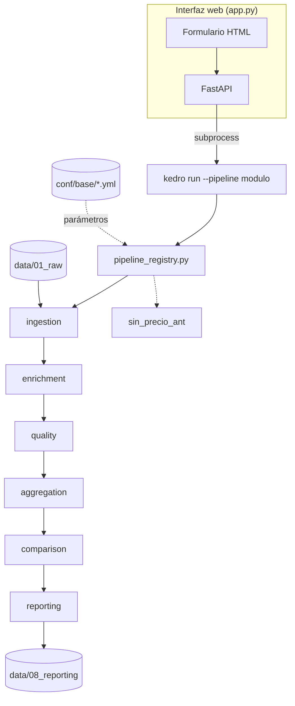

# Arquitectura

## Por qué Kedro

El proceso original vive en programas SAS monolíticos (un `.sas` por módulo,
miles de líneas). La migración necesitaba tres cosas que SAS no da gratis:
pipelines declarativos y testeables, separación de configuración y código, y
la posibilidad de correr un solo nodo sin rehacer todo el proceso. Kedro
resuelve esto de fábrica: cada paso es una función pura registrada en un
grafo de dependencias (`pipeline_registry.py`), y `kedro run --to-outputs
<dataset>` ejecuta solo el subgrafo necesario — clave para regenerar una
línea base histórica sin tocar el período activo (ver
[05_flujo_datos.md](05_flujo_datos.md)).

## Por qué FastAPI encima de Kedro

Kedro se opera por CLI. Para que un analista no técnico pueda cambiar el
período activo, cargar archivos de entrada y lanzar el proceso sin abrir una
terminal, `app.py` expone una interfaz web mínima (FastAPI + Jinja2) que
invoca `kedro run` como subproceso y transmite el log en vivo. No reemplaza a
Kedro, es una capa de operación sobre él.

## Componentes

## Los 6 módulos del pipeline principal

Cada uno de los 9 módulos de insumos (Agrícolas, Pecuarios, Elementos,
Empaques, Arriendos, Servicios, Propagación, Jornales, Especies) instancia la
misma secuencia de 6 etapas vía namespace de Kedro
(`pipeline(ingestion(), namespace=modulo, ...)` en `pipeline_registry.py`),
de forma que los datasets no colisionan entre módulos aunque el código sea
idéntico.

1. **ingestion** — lee el Excel "base liviana" del mes, filtra por Estado y
   Precio, normaliza columnas.
2. **enrichment** — cruza con DIVIPOLA (municipio/departamento) y con los
   mappings de Grupo/Nombre de publicación; actualiza esos mappings
   automáticamente si el módulo trae su propio archivo DIVIPOLA.
3. **quality** — detecta duplicados, calcula coeficiente de variación,
   clasifica variaciones atípicas (`REVISA`) contra el período anterior.
4. **aggregation** — precio promedio por municipio-producto y filtro de
   secreto estadístico (mínimo de fuentes para publicar).
5. **comparison** — variación % e interpretación de tendencia contra el
   período anterior.
6. **reporting** — exporta todos los `.xlsx` finales (BASES, ANEXO, CUADROS,
   TABLAS, MAYORESQUE2/MENORESQUE2, diagnósticos) replicando exactamente el
   formato de columnas de SAS.

Un pipeline auxiliar, **sin_precio_ant**, corre *después* del principal:
consume el `VAR_ATIPICO_*.xlsx` que el propio proceso genera para armar el
reporte de productos sin precio del período anterior.

## Por qué esta separación y no otra

- **Un archivo de nodos por etapa** (`pipelines/<etapa>/nodes.py` +
  `pipeline.py`): cada etapa es responsable de una sola transformación
  (SRP). Facilita testear `detectar_duplicados` sin levantar todo el
  pipeline.
- **`utils/` separado de `pipelines/`**: `parsers.py` y `excel_writer.py` no
  conocen ningún módulo de insumos en particular — son capacidades genéricas
  reutilizadas por los 9 módulos. Si una función necesita saber qué módulo es
  ("AGRICOLAS" vs "SERVICIOS"), no pertenece a `utils/`.
- **`validations/schemas.py`**: los contratos de datos (columnas esperadas,
  tipos) viven separados de la lógica que los usa, vía Pandera.
