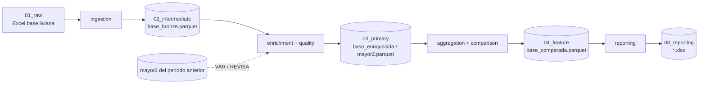

# Flujo de datos

## De dónde vienen los datos

Todo entra manualmente (o vía la interfaz web) en `data/01_raw/<PERIODO>/`,
organizado por período de procesamiento:

```
data/01_raw/JUL2026/
├── BASES LIVIANAS JUL2026/          # Excel de supervisión por módulo, insumo principal
│   └── Insumos agrícolas jul 2026.xlsx
├── DIVIPOLA JUL2026/                # municipio/departamento + Grupo/Nombre_Publica por módulo
│   ├── DIVIPOLA.xlsx                # maestro compartido (municipios/departamentos)
│   └── divipola insumos agrícolas jul 2026.xlsx
├── SIN_PRECIO_ANT JUL2026/          # histórico "para revisiones" (insumo del pipeline auxiliar)
│   └── Ins_Agrícolas para revisiones.xlsx
└── SERIE_DEPTAL JUL2026/            # solo si falta la salida Python del mes anterior:
    └── INSU_AGRIC_MAYORESQUE2_DEPTO_JUN2026.XLSX   # MAYORESQUE2 departamental de SAS
```

La serie departamental escribe en
`data/08_reporting/<periodo>/serie_deptal/<carpeta SAS>/` (`Ins_Agrícolas`,
`Ins_Pecuarios`, `Material_Propaga`, `Arriendos`, `Servicios`, `Elementos`,
`Empaques`, `Jornales`, `Especies`).

Ningún archivo de `data/` se comitea (todo `data/` está en `.gitignore`,
salvo el árbol de directorios) — son insumos y salidas operativas, no
código.

## Transformaciones (capas, estilo Bronze/Silver/Gold)

| Capa Kedro | Carpeta | Rol |
|---|---|---|
| Bronze | `data/02_intermediate/<periodo>/<modulo>/base_bronze_*.parquet` | Ingesta filtrada, sin enriquecer |
| Silver | `data/03_primary/<periodo>/<modulo>/base_enriquecida_*.parquet` | Con DIVIPOLA, Grupo, Nombre_Publica, sin duplicados |
| Silver (agregado) | `data/03_primary/<periodo>/<modulo>/mayor2_*.parquet` / `menor2_*.parquet` | Precio promedio por municipio-producto, con/sin secreto estadístico |
| — | `data/04_feature/<periodo>/<modulo>/base_comparada_*.parquet` | Con variación % y tendencia vs período anterior |
| Gold | `data/08_reporting/<periodo>/<modulo>/*.xlsx` | BASES, ANEXO, CUADROS, TABLAS, MAYORESQUE2, diagnósticos — listos para publicación |



`mayor2` del período anterior (`mayor2_anterior` en el catálogo) es el
insumo clave para VAR/REVISA y la comparación — si no existe (primer
período de un módulo), todo queda `REVISA=2`/`Variacion(%)` vacía sin
romper el resto del pipeline.

## Calendario de módulos

| Módulo | Periodicidad | Meses activos |
|---|---|---|
| Agrícolas, Pecuarios | Mensual | todos |
| Elementos, Empaques | Bimestral impar | ENE, MAR, MAY, JUL, SEP, NOV |
| Propagación | Bimestral par | FEB, ABR, JUN, AGO, OCT, DIC |
| Arriendos, Servicios | Trimestral | FEB, MAY, AGO, NOV |
| Jornales, Especies | Trimestral | MAR, JUN, SEP, DIC |

No hay un flag `activo` automático para el pipeline principal (a diferencia
de `sin_precio_ant`, que sí lo tiene) — decidir qué módulos correr cada mes
es una decisión operativa manual, hecha vía la interfaz web o eligiendo qué
`kedro run --pipeline <modulo>` ejecutar.

## Regenerar la línea base de un período histórico

Cuando el `mayor2_anterior` de un período histórico no existe o quedó
incompleto (vacío por diseño, para no bloquear la primera corrida), se
regenera sin tocar el período activo:

1. Crear en `conf/local/` copias temporales de `globals.yml`,
   `parameters.yml` y `parameters_<modulo>.yml` apuntando al período
   histórico y sus archivos de entrada.
2. Si el período *anterior a ese histórico* tampoco tiene datos, crear un
   parquet vacío en la ruta esperada — el pipeline tolera `mayor2_anterior`
   vacío (clasifica todo `REVISA=2`, no falla).
3. `kedro run --pipeline <modulo>` (completo) o
   `kedro run --pipeline <modulo> --to-outputs <modulo>.<dataset>` (subgrafo
   mínimo, cuando solo hace falta un dataset puntual).
4. Borrar los archivos de `conf/local/` — verificar con `git status` que
   `conf/` queda limpio.
5. Si el período activo real depende de esa línea base corregida, repetir
   apuntando al período activo para regenerar sus salidas finales.

## Pendientes conocidos de paridad con SAS

- **Orden de filas empatadas** (no replicable): SAS ordena el archivo
  CV's (`ORDER BY CV`) y el ANEXO departamental (`ORDER BY CodigoDepto,
  Nombre`) con `PROC SQL`, que no fija el orden de las filas empatadas.
  Filas y valores son idénticos; solo cambia ese orden.
- **Serie departamental** validada FEB–AGO 2026 en cadena (cada mes con la
  salida Python del anterior): Arriendos, Servicios, Jornales, Especies y
  Empaques idénticos; Agrícolas, Pecuarios, Material y Elementos idénticos
  salvo el orden de empates del ANEXO. Pecuarios FEB2026: SAS escribió el
  mes en mayúscula (`FEB2026`); desde ABR usa minúscula, como Python.
- **Julio 2026 (Elementos/Empaques)**: se usa la versión publicada. SAS
  reprocesó julio después de publicarlo; ese reproceso no se usa.
- **Septiembre 2026**: Python es la referencia; la corrida SAS de ese mes
  tuvo errores de parámetros (mes en inglés, año 1926, mes anterior de
  Elementos/Empaques).
- **Elementos/Empaques, línea base MAR2026**: bloqueada — no hay datos
  crudos de marzo 2026 disponibles (ver memoria del proyecto para detalle).
