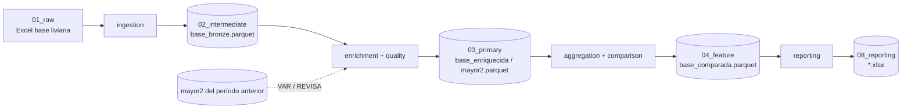

# Flujo de datos

## Ciclo mensual: ejecución preliminar y definitiva

Cada período se procesa en dos rondas:

| Paso | Quién | Qué se hace | Insumos | Salidas |
|---|---|---|---|---|
| 1. Envío inicial | Producción | Se reciben las bases livianas, las DIVIPOLA y los archivos de Sin Precio Anterior | — | `data/01_raw/<P>/` (versión **inicial**) |
| 2. Ejecución preliminar | Este proyecto | Reportes municipales de cada módulo (`kedro run --pipeline <modulo>`) y Sin Precio Anterior (`--pipeline sin_precio_ant`) | Versión inicial | `data/08_reporting/<P>/<modulo>/`, `.../sin_precio_ant/` → se envían a temática |
| 3. Revisión | Temática | Revisa las alertas (VAR_ATIPICO, CV, FALTAN, revisiones…) y corrige precios, novedades y estados | Salidas preliminares | En algunos meses, bases livianas y/o DIVIPOLA **ajustadas** |
| 4. Ejecución definitiva | Este proyecto | Se corren de nuevo los reportes municipales y la serie departamental de los módulos ajustados | Versión ajustada (o inicial si el módulo no se ajustó) | Reemplaza `data/08_reporting/<P>/<modulo>/` y `.../serie_deptal/` |

**Sin Precio Anterior solo se ejecuta en la ronda preliminar**: en la
ejecución definitiva no se vuelve a correr, aunque cambie el VAR_ATIPICO.

La serie departamental forma parte del pipeline de cada módulo, así que en la
ejecución definitiva sale con los mismos insumos que los reportes
municipales. La DIVIPOLA es siempre la misma del procesamiento de bases
livianas, salvo que temática envíe una DIVIPOLA ajustada.

Antes de la ejecución definitiva conviene copiar las salidas preliminares
de los módulos ajustados a `data/08_reporting/<P>/_PRELIMINAR/`, para
conservar lo que se envió a temática.

## De dónde vienen los datos

Todo entra manualmente (o vía la interfaz web) en `data/01_raw/<PERIODO>/`,
organizado por período de procesamiento. Las versiones iniciales y las
ajustadas quedan separadas:

```
data/01_raw/SEP2026/
├── BASES LIVIANAS SEP2026/          # INICIAL: Excel de supervisión por módulo, insumo principal
│   └── Insumos agrícolas sep 2026.xlsx
├── DIVIPOLA SEP2026/                # INICIAL: municipio/departamento + Grupo/Nombre_Publica por módulo
│   ├── DIVIPOLA.xlsx                # maestro compartido (municipios/departamentos)
│   └── divipola insumos agrícolas sep 2026.xlsx
├── SIN_PRECIO_ANT SEP2026/          # histórico "para revisiones" (insumo del pipeline auxiliar)
│   └── Ins_Agrícolas para revisiones.xlsx
├── AJUSTADOS SEP2026/               # AJUSTADA: lo que temática reenvía después de revisar
│   ├── BASES LIVIANAS SEP2026/      #   solo los módulos ajustados, con el MISMO nombre de archivo
│   │   └── Elementos sep 2026.xlsx
│   └── DIVIPOLA SEP2026/            #   solo si reenvían DIVIPOLA (mismo nombre de archivo)
└── SERIE_DEPTAL SEP2026/            # solo si falta la salida Python del mes anterior:
    └── INSU_AGRIC_MAYORESQUE2_DEPTO_AGO2026.XLSX   # MAYORESQUE2 departamental de SAS
```

**Cómo se elige la versión.** Los parámetros siempre apuntan a la versión
inicial. Al leer cada insumo, `utils/insumos.ruta_vigente` busca en
`AJUSTADOS <P>/` un archivo con el mismo nombre en la misma subcarpeta y, si
existe, lo usa en su lugar; si no, usa el inicial. Aplica a la base
liviana, la DIVIPOLA del módulo, el maestro `DIVIPOLA.xlsx` (vía el
resolver `${vigente:...}` del catálogo) y la serie departamental. El log de
Kedro muestra `Insumo AJUSTADO | <ruta>` cada vez que toma una versión
ajustada. Por eso:

- Un módulo que no se ajustó sigue usando su versión inicial sin tocar nada.
- La versión ajustada **debe tener el mismo nombre** que la inicial. La
  interfaz web lo hace sola: al cargar con la opción "ajustada"
  (`?ajustada=true` en `/upload/cuadros/<modulo>` y `/upload/divipola/<tipo>`)
  guarda el archivo en `AJUSTADOS <P>/` con el nombre de la base inicial.
- Para volver a la versión inicial basta con sacar el archivo de
  `AJUSTADOS <P>/`.

La serie departamental escribe en
`data/08_reporting/<periodo>/serie_deptal/<carpeta SAS>/` (`Ins_Agrícolas`,
`Ins_Pecuarios`, `Material_Propaga`, `Arriendos`, `Servicios`, `Elementos`,
`Empaques`, `Jornales`, `Especies`).

Ningún archivo de `data/` se comitea (todo `data/` está en `.gitignore`,
salvo el árbol de directorios) — son insumos y salidas operativas, no
código.

## Transformaciones (capas, estilo Bronze/Silver/Gold)

| Capa Kedro | Carpeta | Rol |
|---|---|---|
| Bronze | `data/02_intermediate/<periodo>/<modulo>/base_bronze_*.parquet` | Ingesta filtrada, sin enriquecer |
| Silver | `data/03_primary/<periodo>/<modulo>/base_enriquecida_*.parquet` | Con DIVIPOLA, Grupo, Nombre_Publica, sin duplicados |
| Silver (agregado) | `data/03_primary/<periodo>/<modulo>/mayor2_*.parquet` / `menor2_*.parquet` | Precio promedio por municipio-producto, con/sin secreto estadístico |
| — | `data/04_feature/<periodo>/<modulo>/base_comparada_*.parquet` | Con variación % y tendencia vs período anterior |
| Gold | `data/08_reporting/<periodo>/<modulo>/*.xlsx` | BASES, ANEXO, CUADROS, TABLAS, MAYORESQUE2, diagnósticos — listos para publicación |



`mayor2` del período anterior (`mayor2_anterior` en el catálogo) es el
insumo clave para VAR/REVISA y la comparación — si no existe (primer
período de un módulo), todo queda `REVISA=2`/`Variacion(%)` vacía sin
romper el resto del pipeline.

## Calendario de módulos

| Módulo | Periodicidad | Meses activos |
|---|---|---|
| Agrícolas, Pecuarios | Mensual | todos |
| Elementos, Empaques | Bimestral impar | ENE, MAR, MAY, JUL, SEP, NOV |
| Propagación | Bimestral par | FEB, ABR, JUN, AGO, OCT, DIC |
| Arriendos, Servicios | Trimestral | FEB, MAY, AGO, NOV |
| Jornales, Especies | Trimestral | MAR, JUN, SEP, DIC |

No hay un flag `activo` automático para el pipeline principal (a diferencia
de `sin_precio_ant`, que sí lo tiene) — decidir qué módulos correr cada mes
es una decisión operativa manual, hecha vía la interfaz web o eligiendo qué
`kedro run --pipeline <modulo>` ejecutar.

## Regenerar la línea base de un período histórico

Cuando el `mayor2_anterior` de un período histórico no existe o quedó
incompleto (vacío por diseño, para no bloquear la primera corrida), se
regenera sin tocar el período activo:

1. Crear en `conf/local/` copias temporales de `globals.yml`,
   `parameters.yml` y `parameters_<modulo>.yml` apuntando al período
   histórico y sus archivos de entrada.
2. Si el período *anterior a ese histórico* tampoco tiene datos, crear un
   parquet vacío en la ruta esperada — el pipeline tolera `mayor2_anterior`
   vacío (clasifica todo `REVISA=2`, no falla).
3. `kedro run --pipeline <modulo>` (completo) o
   `kedro run --pipeline <modulo> --to-outputs <modulo>.<dataset>` (subgrafo
   mínimo, cuando solo hace falta un dataset puntual).
4. Borrar los archivos de `conf/local/` — verificar con `git status` que
   `conf/` queda limpio.
5. Si el período activo real depende de esa línea base corregida, repetir
   apuntando al período activo para regenerar sus salidas finales.

## Pendientes conocidos de paridad con SAS

- **Orden de filas empatadas** (no replicable): SAS ordena el archivo
  CV's (`ORDER BY CV`) y el ANEXO departamental (`ORDER BY CodigoDepto,
  Nombre`) con `PROC SQL`, que no fija el orden de las filas empatadas.
  Filas y valores son idénticos; solo cambia ese orden.
- **Serie departamental** validada FEB–AGO 2026 en cadena (cada mes con la
  salida Python del anterior): Arriendos, Servicios, Jornales, Especies y
  Empaques idénticos; Agrícolas, Pecuarios, Material y Elementos idénticos
  salvo el orden de empates del ANEXO. Pecuarios FEB2026: SAS escribió el
  mes en mayúscula (`FEB2026`); desde ABR usa minúscula, como Python.
- **Julio 2026 (Elementos/Empaques)**: se usa la versión publicada. SAS
  reprocesó julio después de publicarlo; ese reproceso no se usa.
- **Septiembre 2026**: Python es la referencia; la corrida SAS de ese mes
  tuvo errores de parámetros (mes en inglés, año 1926, mes anterior de
  Elementos/Empaques).
- **Elementos/Empaques, línea base MAR2026**: bloqueada — no hay datos
  crudos de marzo 2026 disponibles (ver memoria del proyecto para detalle).
